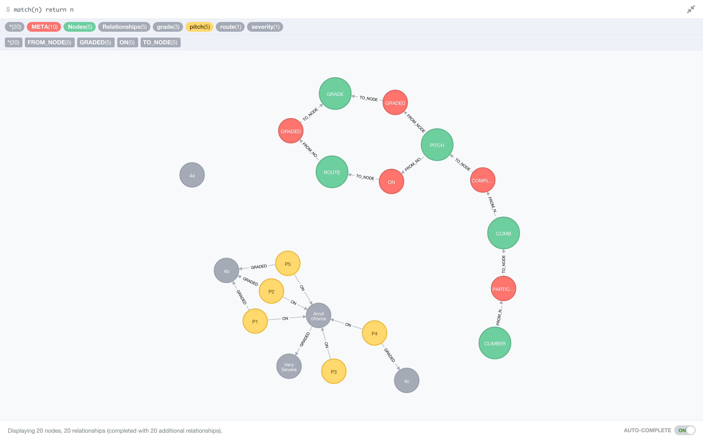

# Neo4J demo

Shows how to use an embedded neo4j server in Java


# Setup 

Need homebrew (make sure you update to get latest formulae)

Need to install neo4j : 

```
    brew update
    brew install neo4j

    neo4j start
```
 
 You can then go to http://localhost:7474/browser/ where you will be asked to login.
 
 Once logged in change your password to `neo4jdemo` that way the demo code will work in this repo.
 
 
 Run "CreateClimnbingIndex_REST" java main class and then go to the browser and type
 
    match(n) return n
    
 To see all the lovely nodes! It should look something like this:
 
 
 